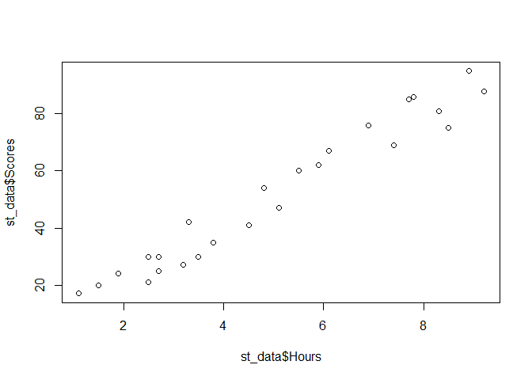
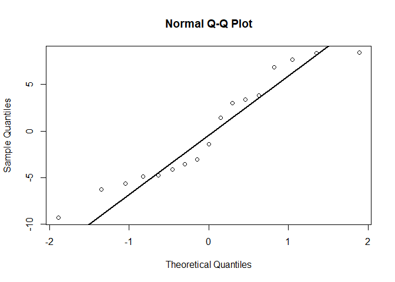
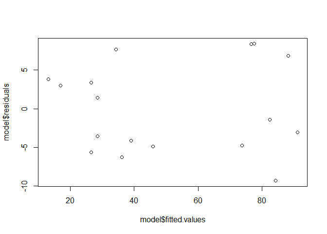
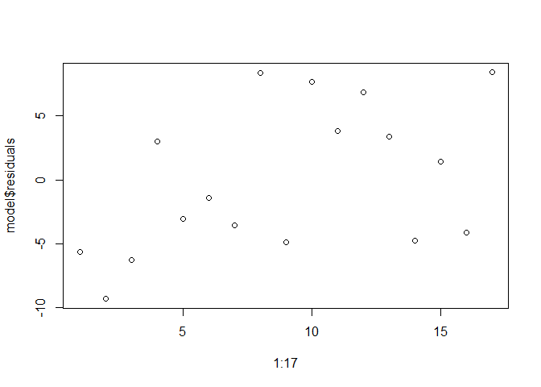
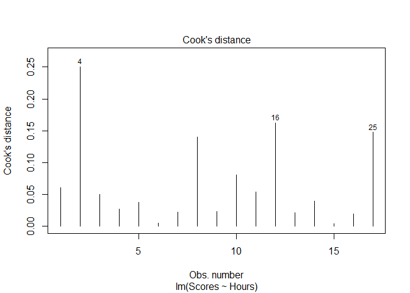
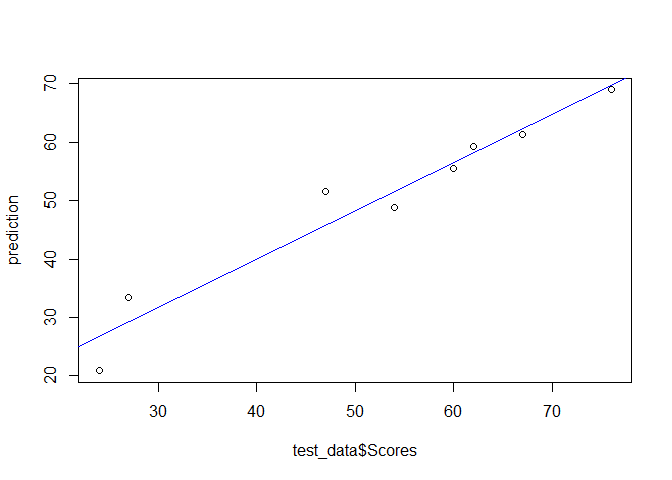

Task 1 - Prediction using Supervised ML
================
Amandeep
2024-04-14

# Introduction

In this regression task we will predict the percentage of marks that a
student is expected to score based upon the number of hours they studied
using **R Programming**. This is a **Simple Linear Regression** task as
it involves just two variables.

**Loading Dataset**

``` r
st_data <- read.csv('http://bit.ly/w-data')
```

**Loading Required libraries**

``` r
library(tidyverse)      # For data manipulation and visualization
```

    ## ── Attaching core tidyverse packages ──────────────────────── tidyverse 2.0.0 ──
    ## ✔ dplyr     1.1.2     ✔ readr     2.1.4
    ## ✔ forcats   1.0.0     ✔ stringr   1.5.0
    ## ✔ ggplot2   3.4.2     ✔ tibble    3.2.1
    ## ✔ lubridate 1.9.2     ✔ tidyr     1.3.0
    ## ✔ purrr     1.0.1     
    ## ── Conflicts ────────────────────────────────────────── tidyverse_conflicts() ──
    ## ✖ dplyr::filter() masks stats::filter()
    ## ✖ dplyr::lag()    masks stats::lag()
    ## ℹ Use the conflicted package (<http://conflicted.r-lib.org/>) to force all conflicts to become errors

``` r
library(caret)          # For machine learning tools
```

    ## Loading required package: lattice
    ## 
    ## Attaching package: 'caret'
    ## 
    ## The following object is masked from 'package:purrr':
    ## 
    ##     lift

``` r
library(caTools)        # For train and test split
library(lmtest)         # For linear regression diagnostics
```

    ## Loading required package: zoo
    ## 
    ## Attaching package: 'zoo'
    ## 
    ## The following objects are masked from 'package:base':
    ## 
    ##     as.Date, as.Date.numeric

``` r
library(broom)          # For tidying model output
library(rmarkdown)      # For Documentation
```

### Exploring Dataset

``` r
head(st_data,6)
```

    ##   Hours Scores
    ## 1   2.5     21
    ## 2   5.1     47
    ## 3   3.2     27
    ## 4   8.5     75
    ## 5   3.5     30
    ## 6   1.5     20

``` r
str(st_data)
```

    ## 'data.frame':    25 obs. of  2 variables:
    ##  $ Hours : num  2.5 5.1 3.2 8.5 3.5 1.5 9.2 5.5 8.3 2.7 ...
    ##  $ Scores: int  21 47 27 75 30 20 88 60 81 25 ...

``` r
summary(st_data)
```

    ##      Hours           Scores     
    ##  Min.   :1.100   Min.   :17.00  
    ##  1st Qu.:2.700   1st Qu.:30.00  
    ##  Median :4.800   Median :47.00  
    ##  Mean   :5.012   Mean   :51.48  
    ##  3rd Qu.:7.400   3rd Qu.:75.00  
    ##  Max.   :9.200   Max.   :95.00

In the given dataset, The Target “Scores” and Predictior “Hours” both
are Quantitative Variable. Hence, we may apply Regression on the given
dataset.

SLR is based on certain assumptions which are as follows -

1.  Linearity : Must be a linear relationship between Predictor and
    Target.
2.  Normality : Errors must be normally distributed.
3.  Homoscadasticity : Errors must have constant variance.
4.  Auto-correlation : Errors must be uncorrelated.(Errors must be
    independent)
5.  Errors must have mean Zero.

### 1. Checking the Linearity assumptions -

#### Through Visualization : Scatter plot between Predictor and Target.

``` r
plot(st_data$Hours, st_data$Scores)
```

<!-- -->

#### Through Statistical Method : Pearson - Correlation Test

``` r
cor.test(st_data$Hours, st_data$Scores)
```

    ## 
    ##  Pearson's product-moment correlation
    ## 
    ## data:  st_data$Hours and st_data$Scores
    ## t = 21.583, df = 23, p-value < 2.2e-16
    ## alternative hypothesis: true correlation is not equal to 0
    ## 95 percent confidence interval:
    ##  0.9459248 0.9896072
    ## sample estimates:
    ##       cor 
    ## 0.9761907

Since, p-value is less than 0.05 and sample correlation is 0.9761907.
Hence, High significant correlation (Highly Linearly Related) exists in
the population.

Rest assumptions will be checked after fitting the model.

### Fitting Model

Before fitting, Split the given dataset into train and test data, fit
the model and obtain summary of model as follows -

#### Split the data into training and test set

``` r
set.seed(12)    # For Reproducibilty 
training_samples <- sample.split(st_data$Scores, SplitRatio = 0.7)
train_data <- st_data[training_samples, ]
test_data <- st_data[!training_samples, ]
```

#### Fit Simple Linear Regression Model

``` r
model <- lm(Scores ~ Hours, data = train_data)
summary(model) 
```

    ## 
    ## Call:
    ## lm(formula = Scores ~ Hours, data = train_data)
    ## 
    ## Residuals:
    ##    Min     1Q Median     3Q    Max 
    ## -9.325 -4.747 -1.401  3.837  8.407 
    ## 
    ## Coefficients:
    ##             Estimate Std. Error t value Pr(>|t|)    
    ## (Intercept)   2.5855     2.9614   0.873    0.396    
    ## Hours         9.6164     0.5122  18.774 7.87e-12 ***
    ## ---
    ## Signif. codes:  0 '***' 0.001 '**' 0.01 '*' 0.05 '.' 0.1 ' ' 1
    ## 
    ## Residual standard error: 5.934 on 15 degrees of freedom
    ## Multiple R-squared:  0.9592, Adjusted R-squared:  0.9565 
    ## F-statistic: 352.5 on 1 and 15 DF,  p-value: 7.872e-12

The above output shows that -

1.  The model is statistically significant since p-value: 7.872e-12 \<
    0.05
2.  Adjusted R-squared: 0.9565 , This shows that 95.65% of the variation
    available in the given dataset (in Scores) is explained by this
    Simple Linear Regression Model. Rest 5% variation in Scores is due
    to some other predictors or due to random cause.
3.  The regression equation for the model is:
    Scores=2.5855+9.6164×Hours
    - Where:
      - Scores is the dependent variable (the variable being predicted).
      - Hours is the independent variable (the predictor).
      - 2.5855 is the intercept, which represents the estimated value of Scores when Hours is zero.
      - 9.6164 is the coefficient for Hours, which indicates the change in Scores for each additional hour of study.

### Check Rest Assumptions -

### 2. Checking Normality Assumption

#### Through Visualization: Q-Q Plot of residuals

``` r
qqnorm(model$residuals)
qqline(model$residuals, col = "black", lwd = 2)
```

<!-- -->

#### Statistical Test: Shapiro-Wilk-Test on residuals

``` r
shapiro.test(model$residuals)
```

    ## 
    ##  Shapiro-Wilk normality test
    ## 
    ## data:  model$residuals
    ## W = 0.92223, p-value = 0.1611

Since p-value (0.1611) \> 0.05 , Hence, Accept the null hypothesis,
i.e., Errors are normally distributed.

### 3. Checking Homoscedasticity Assumption

#### Through Visualization : Residuals vs fitted values Plot

``` r
plot(model$fitted.values, model$residuals)
```

<!-- -->

#### Through Statistical Test : Breusch Pagan test

``` r
bptest(model)
```

    ## 
    ##  studentized Breusch-Pagan test
    ## 
    ## data:  model
    ## BP = 3.0867, df = 1, p-value = 0.07893

Since p-value (0.07893) \> 0.05 , Hence, Accept null hypothesis, i.e.,
Errors have constant variance.

### 4. Auto-correlation Assumption

#### Visualization : Residual vs Order of taking observations.

``` r
plot(1:17, model$residuals)
```

<!-- -->

#### Statistical Test : Durbin-watson Test

``` r
dwtest(model, alternative = c("two.sided"))
```

    ## 
    ##  Durbin-Watson test
    ## 
    ## data:  model
    ## DW = 1.8079, p-value = 0.7689
    ## alternative hypothesis: true autocorrelation is not 0

Since p-value (0.7689) \> 0.05 ; Hence, Accept null hypothesis, i.e.,
Errors are uncorrelated

### 5. Assumption of Mean of errors

#### Calculating mean of errors

``` r
mean(model$residuals)
```

    ## [1] 1.568904e-16

The above output shows that mean of errors is approximately zero.

### Influential point detection

A data point is considered influential if its exclusion causes
substantial changes in the estimated regression.

#### Visualization (Cook’s distance plot)

``` r
plot(model , 4)         # 4 indicates the Cook's Distance plot
```

<!-- -->

#### Statistical Measure

``` r
model_dm <- augment(model)   # Adding additional information
                             # i.e. original values, fitted values, residuals and cooks distance)
```

``` r
head(model_dm)
```

    ## # A tibble: 6 × 9
    ##   .rownames Scores Hours .fitted .resid   .hat .sigma .cooksd .std.resid
    ##   <chr>      <int> <dbl>   <dbl>  <dbl>  <dbl>  <dbl>   <dbl>      <dbl>
    ## 1 1             21   2.5    26.6  -5.63 0.107    5.93 0.0606      -1.00 
    ## 2 4             75   8.5    84.3  -9.32 0.147    5.52 0.250       -1.70 
    ## 3 5             30   3.5    36.2  -6.24 0.0768   5.89 0.0499      -1.09 
    ## 4 6             20   1.5    17.0   2.99 0.153    6.08 0.0270       0.547
    ## 5 7             88   9.2    91.1  -3.06 0.187    6.07 0.0375      -0.571
    ## 6 9             81   8.3    82.4  -1.40 0.137    6.13 0.00515     -0.254

#### Checking Highest Cook’s Distance

``` r
max(model_dm$.cooksd)
```

    ## [1] 0.2502931

**Maximum Cook’s Distance is 0.2502931**

Since, for any observation in train data set, Cook’s distance is not
greater than 0.5, Hence, there is no influential point in the given
dataset.

Now, all the assumptions of Simple Linear Regression has been satisfied.

### Making predictions

``` r
prediction <- model %>% predict(test_data)
```

#### Visualization : Predicted Scores vs Actual Scores plot for test data

``` r
plot(test_data$Scores, prediction)
abline(lm(prediction ~ Scores, data = test_data), col = "blue")
```

<!-- -->

#### Statistical Measure : R2, RMSE and MAE

``` r
data.frame( R2 = R2(prediction, test_data$Scores),
            RMSE = RMSE(prediction, test_data$Scores),
            MAE = MAE(prediction, test_data$Scores))
```

    ##          R2     RMSE      MAE
    ## 1 0.9433345 5.123207 4.925582

**R Squared** : An R-squared value close to 1 (0.9433345) is quite high,
suggesting that the model explains a large proportion of the variance in
the dependent variable. This is a good indication of model performance.

**RMSE** : It measures the average prediction error in the model.
(5.123207) means the model’s predictions have an average error of around
5.12 marks.

**MAE** : It is less sensitive to outliers. An MAE of 4.925582 means the
average absolute prediction error is around 4.93 marks.

### Predict the score for the student studying 9.25 hours

``` r
new_data <- data.frame(Hours = 9.25)
predicted_score <- predict(model, new_data)

# Print the predicted score
print(paste("Predicted score for studying 9.25 hours:", round(predicted_score, 2)))
```

    ## [1] "Predicted score for studying 9.25 hours: 91.54"
